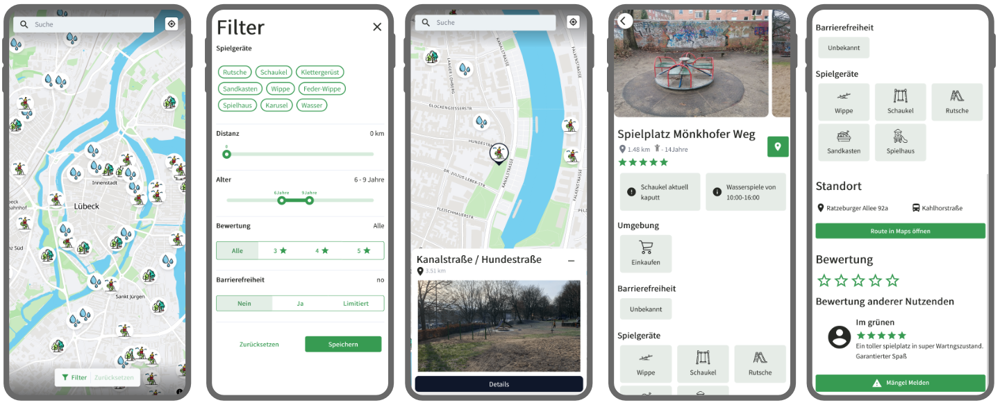

# Platzsy - OpDaHa 2023



This repo contains the Platzsy app, which was develop as part of the Open Data Hackathon 2023 at the University of Lübeck. Finding the right playground for your children and you can be a challenging task. Platzsy supports you in your search by providing you with the information you need in order to make a decision. This includes

- a map of all local playgrounds
- a filter for your personal criteria
- a detailed view of the playtoys and surrounding activities
- a review section to hear about the experiences of others

## Project Setup

This project consists of two parts: the web app in this repo and a StrapiCMS instance that serves as the backend.

### StrapiCMS

For the StrapiCMS setup refer to the `opdata-platzsy-dataset` repo.

### Web app

Make a copy of the `.env.example` file and name it `.env.local`. Replace the contained environment variables with their actual values. `VITE_APP_API_URL` should point to your strapi instance (`http://localhost:1337` for local dev). For the `VITE_MAP_STYLE_URL` you will need to create an account at https://www.maptiler.com/. After all variables are set, continue:

```sh
# Install all dependencies
npm install

# Start the development server
npm run dev
```

Now you should be able to open the app at http://localhost:5173.

#### Type-Check, Compile and Minify for Production

```sh
npm run build
```

## Recommended IDE Setup

[VSCode](https://code.visualstudio.com/) + [Volar](https://marketplace.visualstudio.com/items?itemName=Vue.volar) (and disable Vetur) + [TypeScript Vue Plugin (Volar)](https://marketplace.visualstudio.com/items?itemName=Vue.vscode-typescript-vue-plugin).
